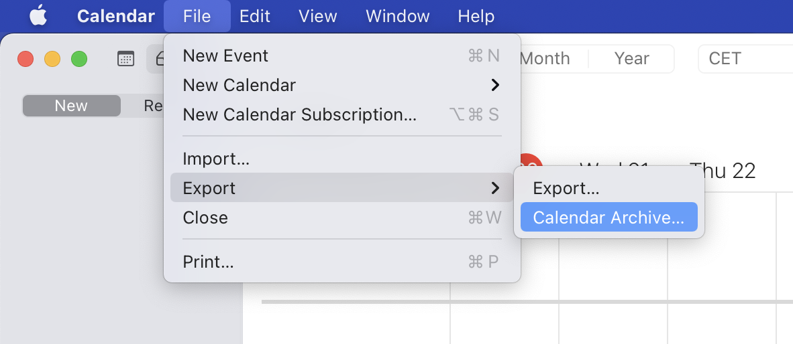
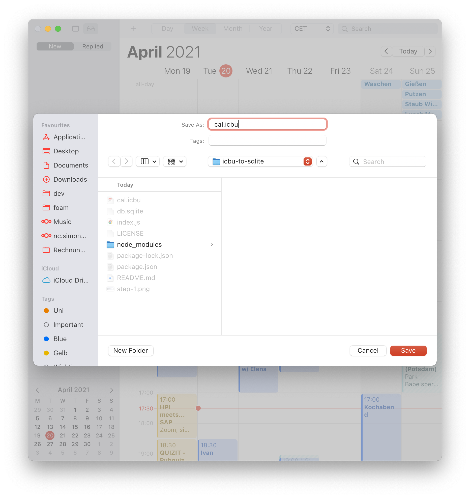
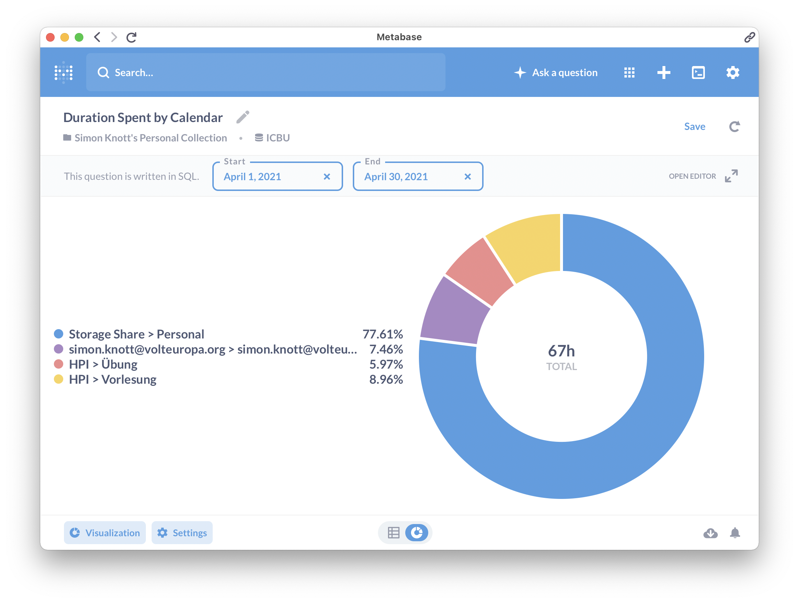

# icbu-to-sqlite

Run full SQL queries on your calendar!

This repo contains a small script to pipe your Apple Calendar data into an SQLite database.

## Usage

1. Clone this repository.

```bash
git clone https://github.com/skn0tt/icbu-to-sqlite /some-dir
```

2. Export your calendar archive into `/some-dir/cal.icbu`.





3. Run `npm i` && `node index.js`.

4. Run your queries on `db.sqlite`!



<details>

<summary>
Full Query
</summary>

```sql
SELECT
  SUM((strftime('%s', dtend) - strftime('%s', dtstart)) / 3600) as duration,
  calendar.title as calendar
FROM event
JOIN calendar ON calendar.id = calendarId
WHERE event.transp <> 'TRANSPARENT'
AND dtstart BETWEEN {{start}} AND {{end}}
GROUP BY calendarId
```

</details>

